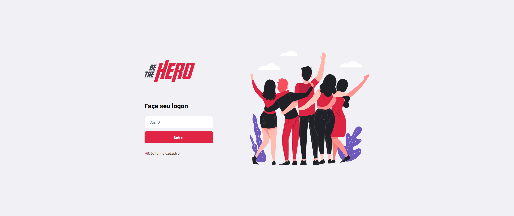

# Be the hero
Aplicação Full stack, tendo como potencial um gerenciamento de ações sociais de possíveis ongs que possam chegar a se cadastrar.

## Reprodução da aplicação web em localhost

1-Faca um clone do repositório.

2-Abra em seu editor de código favorito.

3-Execute yarn ou npm install nas respectivas pastas: mobile, backend, frontend, isso se faz necessário para instalar as dependências do projeto.

4-Abra a pasta backend e execute yarn start ou npm start para iniciar o servidor.

5-Façao mesmo na pasta frontend para servir os arquivos visuais.

## Execução da versão mobile da aplicação.

1-Primeiro instale um emulador em sua maquina, recomendo o (genymotion ou android studio).

2-Execute o emulador, e nele instale um aplicativo chamado expo, ele sera o responsável por ler os arquivos javascript e interpretá-los em ambiente de desenvolvimento.

3-Execute o aplicativo expo.

4-Acesse a pasta mobile usando o terminal do seu sistema operacional e execute yarn start ou npm start para executar o app, nesse momento o emulador ja deve esta executando o expo.

5-No seu navegador ira abrir um painel de controle do expo e nele haverá uma opção de executar o aplicativo no emulador, clique nessa opção e o aplicativo devera iniciar automaticamente no emulador.

6-Lembrando que a pasta backend já deve esta em execução antes de seguir esses passos.

### Qualquer dúvida entre em contato.
### Se Percebeu algum erro de ortografia nessa mini-documentação entre em contato sugerindo alterações caso seja a sua vontade.
